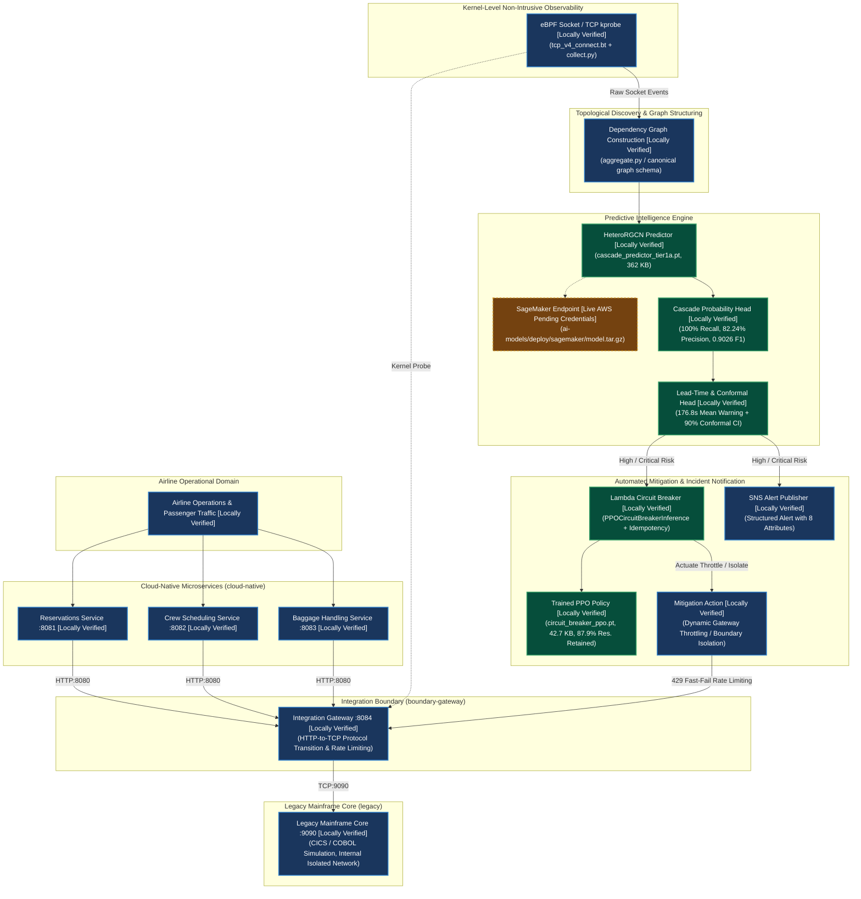
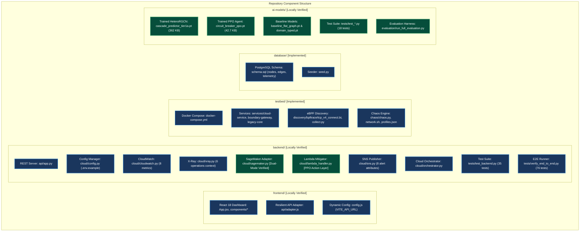
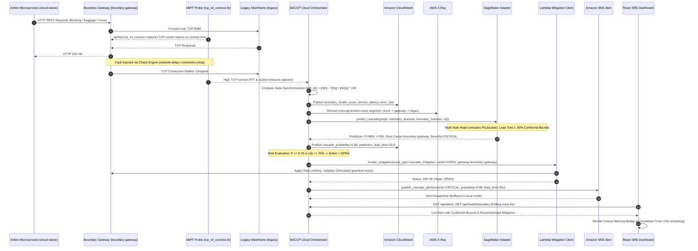

# Architecture & Framework Diagrams

This document contains canonical Mermaid diagrams representing the actual BACCP system. All diagrams strictly distinguish between:
1. **[Locally Verified]** — Fully implemented, trained with real weights, and verified via automated tests in the local environment.
2. **[Live AWS Pending Credentials]** — Fully packaged and integration-tested adapter; live AWS deployment pending provision of production AWS IAM credentials.
3. **[Planned]** — Long-term production extensions (e.g. multi-node EKS cluster, federated cross-carrier learning).

---

## 1. Architecture Overview (Operational Hierarchy)



---

## 2. Component Diagram



---

## 3. Data-Flow Diagram



---

## 4. Cloud Integration Diagram

```mermaid
flowchart TD
    classDef existing fill:#1a365d,stroke:#3182ce,stroke-width:2px,color:#ffffff;
    classDef prototype fill:#744210,stroke:#d69e2e,stroke-width:2px,stroke-dasharray: 4 4,color:#ffffff;
    classDef planned fill:#2d3748,stroke:#a0aec0,stroke-width:1px,stroke-dasharray: 2 2,color:#cbd5e0;

    subgraph LayerApp["1. Application & Testbed Runtime"]
        APP["Airline Services Testbed [Existing]\n(Reservations, Crew, Baggage, Gateway, Legacy Core)"]
        EBPF_APP["eBPF Socket Tracer [Existing]\n(Kernel-space connection latency & error capture)"]
    end

    subgraph LayerObs["2. Observability Ingestion"]
        CW["Amazon CloudWatch Publisher [Existing]\n(BACCP/AirlineCloudHealth Namespace, 8 Metrics)"]
        XR["AWS X-Ray Trace Recorder [Existing]\n(Context-managed trace_operation across 6 paths)"]
    end

    subgraph LayerBackend["3. Backend Integration Layer"]
        CFG["Centralized Config [Existing]\n(CLOUD_MODE: local | aws)"]
        ORCH["BACCP Cloud Orchestrator [Existing]\n(Telemetry -> Predict -> Mitigate -> Alert)"]
        REST["BACCP REST API Server [Existing]\n(backend/api/app.py :8000)"]
    end

    subgraph LayerPredict["4. Model Inference Adapter"]
        SM_ADAPT["SageMaker Model Adapter [Existing Adapter / Prototype Engine]\n(Input: graph, telemetry, boundary features)"]
        SM_LOCAL["Calibrated Analytical Fallback [Prototype]\n(Conformal bounds: 90% confidence interval)"]
        SM_LIVE["SageMaker Realtime Endpoint [Planned]\n(Hosting ai-models/ PyTorch RGCN weights)"]
    end

    subgraph LayerMitigate["5. Mitigation Layer"]
        LAMBDA_CLI["Lambda Mitigation Client [Existing / Prototype]\n(Structured cascade_mitigation payload)"]
        LAMBDA_SIM["Local Simulation Handler [Existing]\n(Simulates Lambda, updates CircuitBreakerManager)"]
        LAMBDA_LIVE["Live AWS Lambda Function [Planned Integration]\n(AWS_LAMBDA_FUNCTION_NAME)"]
    end

    subgraph LayerAlert["6. Notification Layer"]
        SNS_PUB["Amazon SNS Publisher [Existing]\n(8 required alert attributes + local buffer)"]
        SNS_TOPIC["AWS SNS Topic ARN [Existing in aws mode]\n(AWS_SNS_TOPIC_ARN)"]
    end

    subgraph LayerUI["7. Monitoring Presentation"]
        DASH["BACCP React Dashboard [Existing]\n(System Overview, Dependency Graph, Drift Gauge, Alerts)"]
    end

    %% Data Connections
    APP -->|Telemetry & Metrics| CW
    APP -->|Cross-boundary traces| XR
    EBPF_APP -->|State drift ε(t)| ORCH
    
    CFG --> ORCH
    ORCH --> CW
    ORCH --> XR
    ORCH --> SM_ADAPT
    
    SM_ADAPT --> SM_LOCAL
    SM_ADAPT -.->|AWS Mode| SM_LIVE
    
    SM_ADAPT -->|Prediction: P, τ, severity| ORCH
    
    ORCH -->|Risk Evaluation: High/Critical| LAMBDA_CLI
    LAMBDA_CLI --> LAMBDA_SIM
    LAMBDA_CLI -.->|AWS Mode| LAMBDA_LIVE
    
    ORCH -->|Risk Evaluation: High/Critical| SNS_PUB
    SNS_PUB -.->|AWS Mode| SNS_TOPIC
    
    REST --> DASH
    CW -.->|Metrics API| REST
    ORCH -.->|Pipeline status| REST

    class APP,EBPF_APP,CW,XR,CFG,ORCH,REST,SM_ADAPT,LAMBDA_CLI,LAMBDA_SIM,SNS_PUB,SNS_TOPIC,DASH existing;
    class SM_LOCAL prototype;
    class SM_LIVE,LAMBDA_LIVE planned;
```

---

## 5. Prediction & Alerting Flow

```mermaid
flowchart TD
    classDef existing fill:#1a365d,stroke:#3182ce,stroke-width:2px,color:#ffffff;
    classDef prototype fill:#744210,stroke:#d69e2e,stroke-width:2px,stroke-dasharray: 4 4,color:#ffffff;
    classDef planned fill:#2d3748,stroke:#a0aec0,stroke-width:1px,stroke-dasharray: 2 2,color:#cbd5e0;

    IN["Input Telemetry Snapshot [Existing]\n- Graph Nodes & Edges\n- Service Latencies & Error Rates\n- Boundary Sync Drift ε(t)"] --> PREDICT

    subgraph Inference["Model Inference Layer"]
        PREDICT["SageMaker Cascade Predictor [Prototype]\n(Local Analytical Engine / Live Endpoint)"]
        CALIB["Split Conformal Calibration [Prototype]\n1 - α = 0.90 Coverage Guarantee"]
    end

    PREDICT --> CALIB
    CALIB --> EVAL["Risk & Severity Evaluation [Existing]"]

    EVAL -->|P >= 0.75 OR ε(t) >= 70%| CRIT["CRITICAL SEVERITY [Existing]\nLead Time: 8s - 45s"]
    EVAL -->|P >= 0.55 OR ε(t) >= 45%| HIGH["HIGH SEVERITY [Existing]\nLead Time: 30s - 120s"]
    EVAL -->|P >= 0.35| MED["MEDIUM SEVERITY [Existing]\nLead Time: 90s - 240s"]
    EVAL -->|P < 0.35| LOW["LOW / NOMINAL [Existing]\nLead Time: > 300s"]

    CRIT --> ACT_OPEN["Lambda Mitigation: Action = OPEN [Prototype]\nThrottle Rate: 100% (Full Boundary Isolation)"]
    HIGH --> ACT_THROTTLE["Lambda Mitigation: Action = THROTTLED [Prototype]\nDynamic Throttle Rate: 30% - 75%"]
    MED --> ACT_WARN["Dashboard Warning Alert [Existing]\nCircuit Breaker: CLOSED"]
    LOW --> ACT_RESET["Nominal Operation [Existing]\nCircuit Breaker: CLOSED (Reset)"]

    ACT_OPEN --> DISPATCH_SNS["SNS Alert Dispatcher [Existing]\n(Severity: CRITICAL, Urgency: Immediate)"]
    ACT_THROTTLE --> DISPATCH_SNS_HIGH["SNS Alert Dispatcher [Existing]\n(Severity: HIGH, Urgency: High)"]
    
    ACT_OPEN --> CW_METRIC["CloudWatch: publish_circuit_breaker_action [Existing]"]
    ACT_THROTTLE --> CW_METRIC

    class IN,EVAL,CRIT,HIGH,MED,LOW,ACT_WARN,ACT_RESET,DISPATCH_SNS,DISPATCH_SNS_HIGH,CW_METRIC existing;
    class PREDICT,CALIB,ACT_OPEN,ACT_THROTTLE prototype;
```

---

## 6. Multi-Tier Deployment View

```mermaid
flowchart TB
    classDef container fill:#1a365d,stroke:#3182ce,stroke-width:2px,color:#ffffff;
    classDef host fill:#2d3748,stroke:#4a5568,stroke-width:2px,color:#ffffff;
    classDef aws fill:#744210,stroke:#d69e2e,stroke-width:2px,color:#ffffff;

    subgraph DockerHost["Physical / VM Linux Docker Host"]
        direction TB

        subgraph NetCloud["Docker Network: cloud-tier (Bridge)"]
            C_RES["reservations:8080\n(Host Port 8081)"]
            C_CREW["crew:8080\n(Host Port 8082)"]
            C_BAG["baggage:8080\n(Host Port 8083)"]
        end

        subgraph NetDual["Dual-Homed Gateway Container"]
            C_GW["boundary-gateway:8080\n(Host Port 8084)\nConnected to cloud-tier AND legacy-tier"]
        end

        subgraph NetLegacy["Docker Network: legacy-tier (Internal Isolated)"]
            C_LEG["legacy-core:9090\n(Unpublished, unreachable from cloud microservices)"]
        end

        subgraph NetData["Docker Network: data-tier (Internal Isolated)"]
            C_DB["PostgreSQL 16:5432\n(DB: baccp, schema.sql)"]
        end

        subgraph HostProcesses["Host Kernel & Application Processes"]
            K_BPF["Linux Kernel eBPF (kprobe:tcp_v4_connect)"]
            B_API["BACCP Backend REST Server :8000 (Python 3)"]
            F_UI["BACCP React Dashboard :3000 (Vite / Node.js)"]
        end

        C_RES -->|HTTP:8080| C_GW
        C_CREW -->|HTTP:8080| C_GW
        C_BAG -->|HTTP:8080| C_GW
        C_GW -->|TCP:9090| C_LEG
        K_BPF -.->|Trace kernel connections| C_GW
        B_API -->|Read topology & seed| C_DB
        F_UI -->|REST Polling 6s| B_API
    end

    subgraph AWSCloud["AWS Cloud VPC (Enabled in CLOUD_MODE=aws)"]
        AWS_CW["Amazon CloudWatch\n(Namespace: BACCP/AirlineCloudHealth)"]
        AWS_XR["AWS X-Ray Daemon :2000 (UDP)"]
        AWS_SM["Amazon SageMaker\n(Endpoint: baccp-cascade-predictor)"]
        AWS_LM["AWS Lambda Function\n(baccp-circuit-breaker-mitigator)"]
        AWS_SNS["Amazon SNS Topic\n(baccp-cascade-alerts)"]
    end

    B_API -.->|Metrics API| AWS_CW
    B_API -.->|Trace UDP| AWS_XR
    B_API -.->|Invoke Endpoint| AWS_SM
    B_API -.->|Invoke Function| AWS_LM
    B_API -.->|Publish Topic| AWS_SNS

    class C_RES,C_CREW,C_BAG,C_GW,C_LEG,C_DB,K_BPF,B_API,F_UI container;
    class DockerHost,HostProcesses host;
    class AWS_CW,AWS_XR,AWS_SM,AWS_LM,AWS_SNS aws;
```


