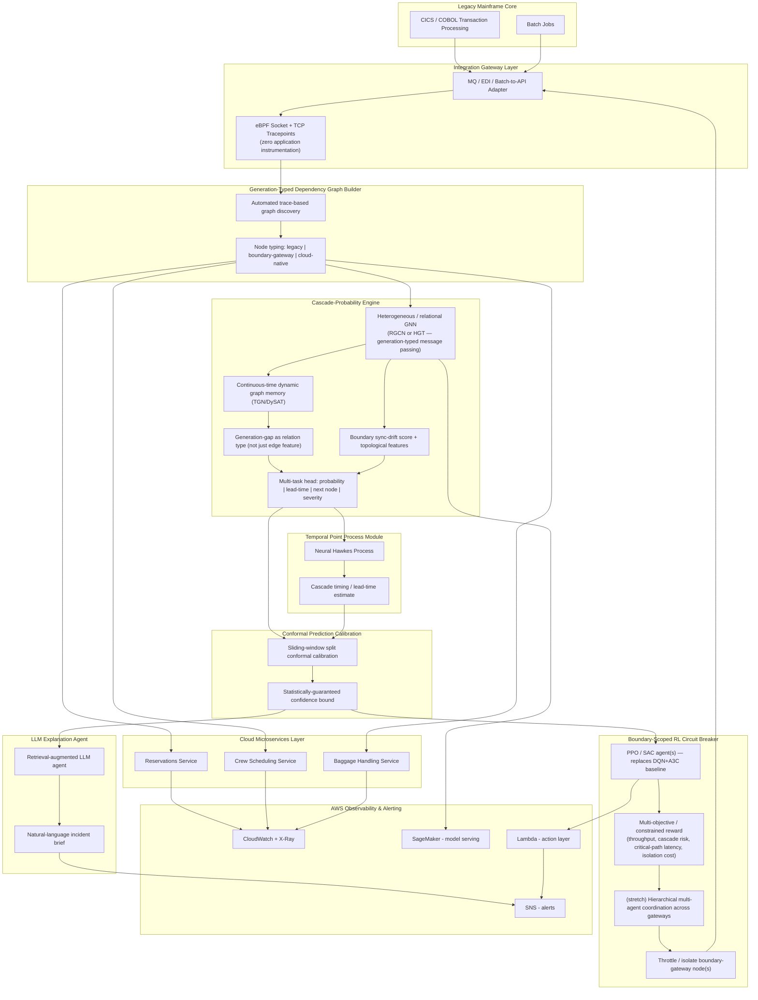

# Architecture / Framework Diagram

This diagram is written in [Mermaid](https://mermaid.js.org/), which GitHub renders natively when viewing this file in the repository — no image export needed.

## Component Notes

| Component | Purpose | Reference technique |
|---|---|---|
| eBPF tracepoints | Observe the legacy/cloud boundary without instrumenting the mainframe | Zero-instrumentation kernel tracing |
| Graph Builder | Auto-construct dependency graph from trace data, typed by technology generation | Automated model-discovery + heterogeneous graph typing |
| **Cascade-Probability Engine** | Predict cross-generation cascade probability, timing, location, and severity | Heterogeneous/relational GNN (RGCN/HGT) + continuous-time dynamic graph (TGN/DySAT) + multi-task head |
| Boundary sync-drift score | Quantify legacy/cloud state divergence at the gateway | Digital-twin state-synchronization formulation + topological centrality features |
| Temporal Point Process Module | Estimate *when* a cascade will cross the boundary, not just whether | Neural Hawkes Process / RMTPP (self-exciting event intensity) |
| Conformal Prediction Calibration | Give every alert a statistically-valid confidence bound; bound false-alarm rate | Split conformal prediction, sliding-window temporal calibration |
| LLM Explanation Agent | Turn raw graph/timing/RL output into a human-readable incident brief | Retrieval-augmented LLM agent, agentic AIOps pattern |
| **RL Circuit Breaker** | Coordinate throttling across boundary nodes so a local fix doesn't starve a dependent service | PPO/SAC + multi-objective reward design; hierarchical multi-agent coordination (stretch) |
| AWS layer | Telemetry, model serving, automated action, alerting | CloudWatch, X-Ray, SageMaker, Lambda, SNS |

## Novelty rationale (summary — full tiered detail in `ai-models/README.md`)

- **Heterogeneous/relational message passing** is the highest-value single upgrade: it directly answers the literature survey's own gap statement, since no reviewed work types message-passing weights by technology generation.
- **Hierarchical multi-agent RL coordination** (stretch goal) is the strongest mitigation-side claim: it directly closes a gap the original DRL rate-limiting paper's authors named themselves as unsolved future work.
- **Multi-task prediction head + calibrated uncertainty** turns a single probability score into an operationally useful statement ("87% confident a cascade starts at Gateway-X in ~4.2 min"), which is a genuinely useful airline-operator-facing capability, not just a metrics-table improvement.
- The full set of Tier 1/Tier 2 options, their complexity, and the suggested build order live in `ai-models/README.md` — this diagram shows the recommended core path, not every option under consideration.
