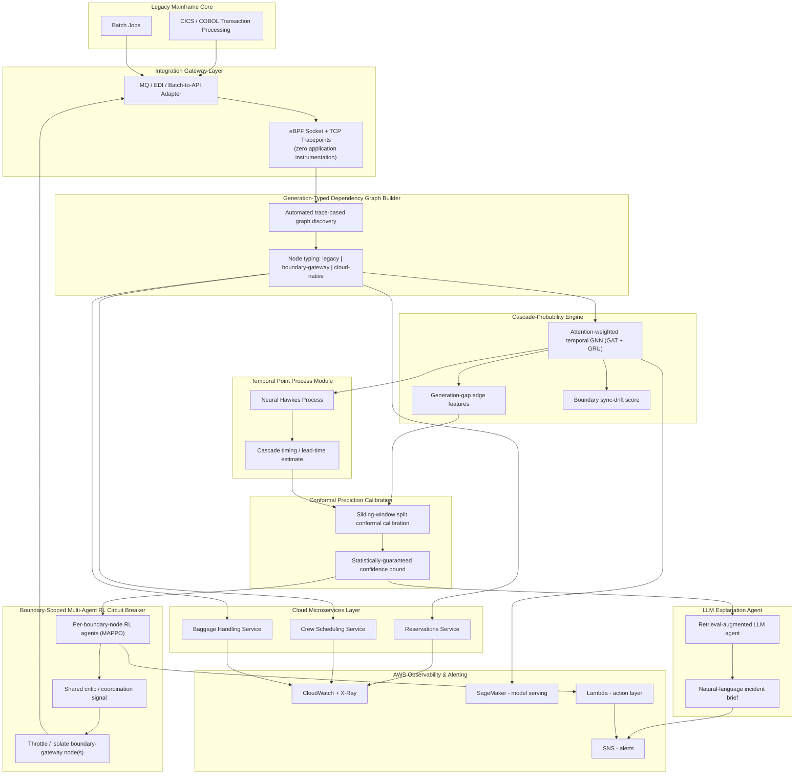

# Architecture / Framework Diagram

This diagram is written in [Mermaid](https://mermaid.js.org/), which GitHub renders natively when viewing this file in the repository — no image export needed.

## Component Notes

| Component | Purpose | Reference technique |
|---|---|---|
| eBPF tracepoints | Observe the legacy/cloud boundary without instrumenting the mainframe | Zero-instrumentation kernel tracing |
| Graph Builder | Auto-construct dependency graph from trace data, typed by technology generation | Automated model-discovery + heterogeneous graph typing |
| Cascade-Probability Engine | Predict cross-generation cascade probability & lead time | Attention/temporal GNN + cascade-probability modeling |
| Boundary sync-drift score | Quantify legacy/cloud state divergence at the gateway | Digital-twin state-synchronization formulation |
| **Temporal Point Process Module** | Estimate *when* a cascade will cross the boundary, not just whether | Neural Hawkes Process / RMTPP (self-exciting event intensity) |
| **Conformal Prediction Calibration** | Give every alert a statistically-valid confidence bound; bound false-alarm rate | Split conformal prediction, sliding-window temporal calibration |
| **LLM Explanation Agent** | Turn raw graph/timing/RL output into a human-readable incident brief | Retrieval-augmented LLM agent, agentic AIOps pattern |
| **Multi-Agent RL Circuit Breaker** | Coordinate throttling across boundary nodes so a local fix doesn't starve a dependent service | MAPPO / MADDPG multi-agent reinforcement learning |
| AWS layer | Telemetry, model serving, automated action, alerting | CloudWatch, X-Ray, SageMaker, Lambda, SNS |

## Why these four (novelty rationale)

- **Multi-Agent RL circuit breaker** is the strongest addition: it directly closes a gap the original DRL rate-limiting paper's authors named themselves as unsolved future work (single-service optimization can starve a dependent service — exactly the cascading-failure scenario this project targets).
- **Temporal Point Process module** upgrades "cascade probability" into "cascade probability *and* estimated time," making the project's headline lead-time metric statistically principled rather than informal.
- **Conformal Prediction calibration** is the cheapest addition and the one that makes every other component's output trustworthy — it turns raw model scores into statistically-guaranteed confidence bounds without needing to retrain anything.
- **LLM Explanation Agent** is the most demo-friendly: it's what turns a dashboard full of numbers into a live, understandable incident narrative for a presentation.
