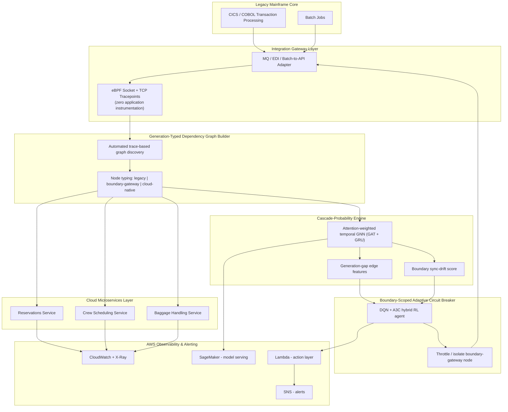

# Architecture / Framework Diagram

This diagram is written in [Mermaid](https://mermaid.js.org/), which GitHub renders natively when viewing this file in the repository — no image export needed.

## Component Notes

| Component | Purpose | Reference technique |
|---|---|---|
| eBPF tracepoints | Observe the legacy/cloud boundary without instrumenting the mainframe | Zero-instrumentation kernel tracing |
| Graph Builder | Auto-construct dependency graph from trace data, typed by technology generation | Automated model-discovery + heterogeneous graph typing |
| Cascade-Probability Engine | Predict cross-generation cascade probability & lead time | Attention/temporal GNN + cascade-probability modeling |
| Boundary sync-drift score | Quantify legacy/cloud state divergence at the gateway | Digital-twin state-synchronization formulation |
| Circuit Breaker | Automatically throttle/isolate the boundary node before cascade spreads | RL-based adaptive rate limiting, scoped to boundary nodes |
| AWS layer | Telemetry, model serving, automated action, alerting | CloudWatch, X-Ray, SageMaker, Lambda, SNS |
