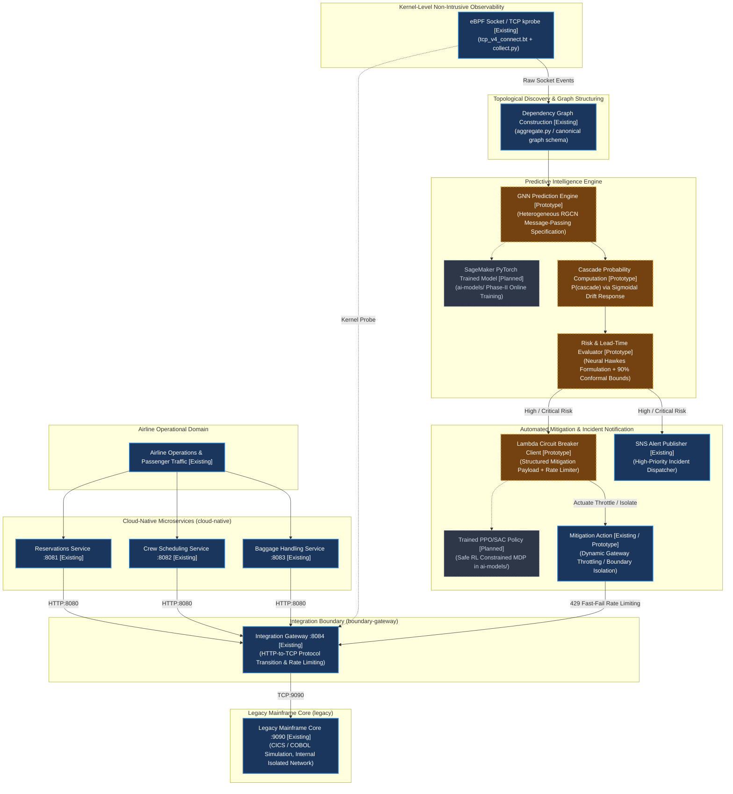
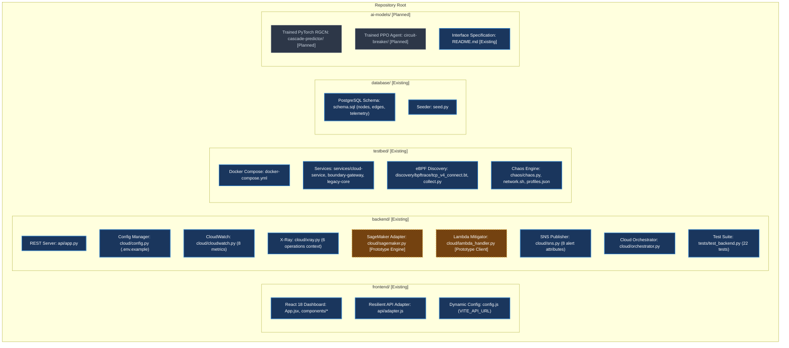
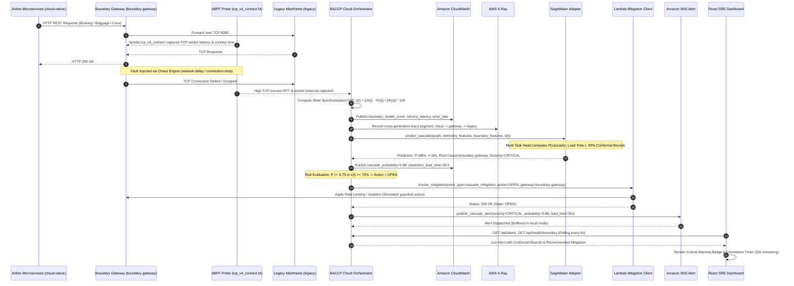

# BACCP Canonical System Architecture

**Boundary-Aware Cross-Generation Cascade Predictor (BACCP) for Airline IT Systems**

This canonical document specifies the complete system architecture of BACCP. It accurately reflects the **actual repository implementation**, explicitly distinguishing between **Existing Implementation**, **Prototype Implementation**, and **Planned / Future Components**.

---

## 1. Implementation Status Legend

To maintain strict scientific and engineering integrity, all components across the diagrams and specifications are classified into one of three implementation states:

| Status Badge | Meaning | Implementation Location |
| :--- | :--- | :--- |
| `[Existing]` | **Fully implemented and operational** in the codebase. Tested with automated unit/integration suites. | `backend/api/app.py`, `backend/cloud/config.py`, `backend/cloud/cloudwatch.py`, `backend/cloud/xray.py`, `backend/cloud/sns.py`, `backend/cloud/orchestrator.py`, `frontend/src/*`, `testbed/services/*`, `testbed/discovery/*`, `database/schema.sql`. |
| `[Prototype]` | **Functioning working prototype / simulated provider**. Uses calibrated analytical inference or simulated action guardrails pending full model training. | `backend/cloud/sagemaker.py` (Analytical engine with $1-\alpha=0.90$ conformal bounds), `backend/cloud/lambda_handler.py` (simulated local circuit breaker). |
| `[Planned]` | **Architecture-specified design scheduled for Phase-II**. Concrete interface contracts exist, but model weights or production integration are future deliverables. | `ai-models/` (Trained PyTorch RGCN weights, continuous Hawkes point process training, online RL PPO policy training). |

---

## 2. BACCP End-to-End System Architecture

This diagram directly models the operational hierarchy of an airline IT ecosystem: passenger and operations traffic flowing into cloud-native microservices, converging through the boundary integration gateway to the legacy mainframe, traced non-intrusively via eBPF, transformed into generation-typed dependency graphs, analyzed for cascade risk and lead time, and actuating automated circuit breaking and SNS alerts.



---

## 3. AWS Observability & Cloud Integration Layer

BACCP incorporates a modular provider/adapter architecture connecting the testbed application to AWS CloudWatch, AWS X-Ray, Amazon SageMaker, AWS Lambda, and Amazon SNS. It operates in dual-mode: **local mode** (zero AWS credentials required, in-memory buffers) and **live AWS mode** (via `boto3`).

```mermaid
flowchart TD
    classDef existing fill:#1a365d,stroke:#3182ce,stroke-width:2px,color:#ffffff;
    classDef prototype fill:#744210,stroke:#d69e2e,stroke-width:2px,stroke-dasharray: 4 4,color:#ffffff;
    classDef planned fill:#2d3748,stroke:#a0aec0,stroke-width:1px,stroke-dasharray: 2 2,color:#cbd5e0;

    subgraph LayerApp["1. Application & Testbed Runtime"]
        APP["Airline Services Testbed [Existing]\n(Reservations, Crew, Baggage, Gateway, Legacy Core)"]
        EBPF_APP["eBPF Socket Tracer [Existing]\n(Kernel-space connection latency & error capture)"]
    end

    subgraph LayerObs["2. Observability Ingestion"]
        CW["Amazon CloudWatch Publisher [Existing]\n(BACCP/AirlineCloudHealth Namespace, 8 Metrics)"]
        XR["AWS X-Ray Trace Recorder [Existing]\n(Context-managed trace_operation across 6 paths)"]
    end

    subgraph LayerBackend["3. Backend Integration Layer"]
        CFG["Centralized Config [Existing]\n(CLOUD_MODE: local | aws)"]
        ORCH["BACCP Cloud Orchestrator [Existing]\n(Telemetry -> Predict -> Mitigate -> Alert)"]
        REST["BACCP REST API Server [Existing]\n(backend/api/app.py :8000)"]
    end

    subgraph LayerPredict["4. Model Inference Adapter"]
        SM_ADAPT["SageMaker Model Adapter [Existing Adapter / Prototype Engine]\n(Input: graph, telemetry, boundary features)"]
        SM_LOCAL["Calibrated Analytical Fallback [Prototype]\n(Conformal bounds: 90% confidence interval)"]
        SM_LIVE["SageMaker Realtime Endpoint [Planned]\n(Hosting ai-models/ PyTorch RGCN weights)"]
    end

    subgraph LayerMitigate["5. Mitigation Layer"]
        LAMBDA_CLI["Lambda Mitigation Client [Existing / Prototype]\n(Structured cascade_mitigation payload)"]
        LAMBDA_SIM["Local Simulation Handler [Existing]\n(Simulates Lambda, updates CircuitBreakerManager)"]
        LAMBDA_LIVE["Live AWS Lambda Function [Planned Integration]\n(AWS_LAMBDA_FUNCTION_NAME)"]
    end

    subgraph LayerAlert["6. Notification Layer"]
        SNS_PUB["Amazon SNS Publisher [Existing]\n(8 required alert attributes + local buffer)"]
        SNS_TOPIC["AWS SNS Topic ARN [Existing in aws mode]\n(AWS_SNS_TOPIC_ARN)"]
    end

    subgraph LayerUI["7. Monitoring Presentation"]
        DASH["BACCP React Dashboard [Existing]\n(System Overview, Dependency Graph, Drift Gauge, Alerts)"]
    end

    %% Data Connections
    APP -->|Telemetry & Metrics| CW
    APP -->|Cross-boundary traces| XR
    EBPF_APP -->|State drift ε(t)| ORCH
    
    CFG --> ORCH
    ORCH --> CW
    ORCH --> XR
    ORCH --> SM_ADAPT
    
    SM_ADAPT --> SM_LOCAL
    SM_ADAPT -.->|AWS Mode| SM_LIVE
    
    SM_ADAPT -->|Prediction: P, τ, severity| ORCH
    
    ORCH -->|Risk Evaluation: High/Critical| LAMBDA_CLI
    LAMBDA_CLI --> LAMBDA_SIM
    LAMBDA_CLI -.->|AWS Mode| LAMBDA_LIVE
    
    ORCH -->|Risk Evaluation: High/Critical| SNS_PUB
    SNS_PUB -.->|AWS Mode| SNS_TOPIC
    
    REST --> DASH
    CW -.->|Metrics API| REST
    ORCH -.->|Pipeline status| REST

    class APP,EBPF_APP,CW,XR,CFG,ORCH,REST,SM_ADAPT,LAMBDA_CLI,LAMBDA_SIM,SNS_PUB,SNS_TOPIC,DASH existing;
    class SM_LOCAL prototype;
    class SM_LIVE,LAMBDA_LIVE planned;
```

---

## 4. Component Architecture & Source Tree Mapping

Every architectural component corresponds to concrete files in the repository:



---

## 5. End-to-End Data Flow Architecture

The data pipeline processes information from Linux kernel probes through graph derivation, analytical inference, and presentation:



---

## 6. Prediction & Mitigation Decision Flow

```mermaid
flowchart TD
    classDef existing fill:#1a365d,stroke:#3182ce,stroke-width:2px,color:#ffffff;
    classDef prototype fill:#744210,stroke:#d69e2e,stroke-width:2px,stroke-dasharray: 4 4,color:#ffffff;
    classDef planned fill:#2d3748,stroke:#a0aec0,stroke-width:1px,stroke-dasharray: 2 2,color:#cbd5e0;

    IN["Input Telemetry Snapshot [Existing]\n- Graph Nodes & Edges\n- Service Latencies & Error Rates\n- Boundary Sync Drift ε(t)"] --> PREDICT

    subgraph Inference["Model Inference Layer"]
        PREDICT["SageMaker Cascade Predictor [Prototype]\n(Local Analytical Engine / Live Endpoint)"]
        CALIB["Split Conformal Calibration [Prototype]\n1 - α = 0.90 Coverage Guarantee"]
    end

    PREDICT --> CALIB
    CALIB --> EVAL["Risk & Severity Evaluation [Existing]"]

    EVAL -->|P >= 0.75 OR ε(t) >= 70%| CRIT["CRITICAL SEVERITY [Existing]\nLead Time: 8s - 45s"]
    EVAL -->|P >= 0.55 OR ε(t) >= 45%| HIGH["HIGH SEVERITY [Existing]\nLead Time: 30s - 120s"]
    EVAL -->|P >= 0.35| MED["MEDIUM SEVERITY [Existing]\nLead Time: 90s - 240s"]
    EVAL -->|P < 0.35| LOW["LOW / NOMINAL [Existing]\nLead Time: > 300s"]

    CRIT --> ACT_OPEN["Lambda Mitigation: Action = OPEN [Prototype]\nThrottle Rate: 100% (Full Boundary Isolation)"]
    HIGH --> ACT_THROTTLE["Lambda Mitigation: Action = THROTTLED [Prototype]\nDynamic Throttle Rate: 30% - 75%"]
    MED --> ACT_WARN["Dashboard Warning Alert [Existing]\nCircuit Breaker: CLOSED"]
    LOW --> ACT_RESET["Nominal Operation [Existing]\nCircuit Breaker: CLOSED (Reset)"]

    ACT_OPEN --> DISPATCH_SNS["SNS Alert Dispatcher [Existing]\n(Severity: CRITICAL, Urgency: Immediate)"]
    ACT_THROTTLE --> DISPATCH_SNS_HIGH["SNS Alert Dispatcher [Existing]\n(Severity: HIGH, Urgency: High)"]
    
    ACT_OPEN --> CW_METRIC["CloudWatch: publish_circuit_breaker_action [Existing]"]
    ACT_THROTTLE --> CW_METRIC

    class IN,EVAL,CRIT,HIGH,MED,LOW,ACT_WARN,ACT_RESET,DISPATCH_SNS,DISPATCH_SNS_HIGH,CW_METRIC existing;
    class PREDICT,CALIB,ACT_OPEN,ACT_THROTTLE prototype;
```

---

## 7. Multi-Tier Deployment View

```mermaid
flowchart TB
    classDef container fill:#1a365d,stroke:#3182ce,stroke-width:2px,color:#ffffff;
    classDef host fill:#2d3748,stroke:#4a5568,stroke-width:2px,color:#ffffff;
    classDef aws fill:#744210,stroke:#d69e2e,stroke-width:2px,color:#ffffff;

    subgraph DockerHost["Physical / VM Linux Docker Host"]
        direction TB

        subgraph NetCloud["Docker Network: cloud-tier (Bridge)"]
            C_RES["reservations:8080\n(Host Port 8081)"]
            C_CREW["crew:8080\n(Host Port 8082)"]
            C_BAG["baggage:8080\n(Host Port 8083)"]
        end

        subgraph NetDual["Dual-Homed Gateway Container"]
            C_GW["boundary-gateway:8080\n(Host Port 8084)\nConnected to cloud-tier AND legacy-tier"]
        end

        subgraph NetLegacy["Docker Network: legacy-tier (Internal Isolated)"]
            C_LEG["legacy-core:9090\n(Unpublished, unreachable from cloud microservices)"]
        end

        subgraph NetData["Docker Network: data-tier (Internal Isolated)"]
            C_DB["PostgreSQL 16:5432\n(DB: baccp, schema.sql)"]
        end

        subgraph HostProcesses["Host Kernel & Application Processes"]
            K_BPF["Linux Kernel eBPF (kprobe:tcp_v4_connect)"]
            B_API["BACCP Backend REST Server :8000 (Python 3)"]
            F_UI["BACCP React Dashboard :3000 (Vite / Node.js)"]
        end

        C_RES -->|HTTP:8080| C_GW
        C_CREW -->|HTTP:8080| C_GW
        C_BAG -->|HTTP:8080| C_GW
        C_GW -->|TCP:9090| C_LEG
        K_BPF -.->|Trace kernel connections| C_GW
        B_API -->|Read topology & seed| C_DB
        F_UI -->|REST Polling 6s| B_API
    end

    subgraph AWSCloud["AWS Cloud VPC (Enabled in CLOUD_MODE=aws)"]
        AWS_CW["Amazon CloudWatch\n(Namespace: BACCP/AirlineCloudHealth)"]
        AWS_XR["AWS X-Ray Daemon :2000 (UDP)"]
        AWS_SM["Amazon SageMaker\n(Endpoint: baccp-cascade-predictor)"]
        AWS_LM["AWS Lambda Function\n(baccp-circuit-breaker-mitigator)"]
        AWS_SNS["Amazon SNS Topic\n(baccp-cascade-alerts)"]
    end

    B_API -.->|Metrics API| AWS_CW
    B_API -.->|Trace UDP| AWS_XR
    B_API -.->|Invoke Endpoint| AWS_SM
    B_API -.->|Invoke Function| AWS_LM
    B_API -.->|Publish Topic| AWS_SNS

    class C_RES,C_CREW,C_BAG,C_GW,C_LEG,C_DB,K_BPF,B_API,F_UI container;
    class DockerHost,HostProcesses host;
    class AWS_CW,AWS_XR,AWS_SM,AWS_LM,AWS_SNS aws;
```



---

## 8. Architectural Consistency & Traceability Matrix

Every architectural node has been compared against the actual repository source code and REST APIs:

| Architectural Component | Generation Type | Status | Repository Source File | Verification / Test |
| :--- | :--- | :--- | :--- | :--- |
| **Reservations Service** | `cloud-native` | `[Existing]` | [`testbed/services/cloud-service/app.py`](file:///Users/bhiwanshusharma/Documents/Cloud_Project/testbed/services/cloud-service/app.py) | Verified via `testbed/docker-compose.yml` (Port 8081) |
| **Crew Service** | `cloud-native` | `[Existing]` | [`testbed/services/cloud-service/app.py`](file:///Users/bhiwanshusharma/Documents/Cloud_Project/testbed/services/cloud-service/app.py) | Verified via `testbed/docker-compose.yml` (Port 8082) |
| **Baggage Service** | `cloud-native` | `[Existing]` | [`testbed/services/cloud-service/app.py`](file:///Users/bhiwanshusharma/Documents/Cloud_Project/testbed/services/cloud-service/app.py) | Verified via `testbed/docker-compose.yml` (Port 8083) |
| **Boundary Gateway** | `boundary-gateway` | `[Existing]` | [`testbed/services/boundary-gateway/app.py`](file:///Users/bhiwanshusharma/Documents/Cloud_Project/testbed/services/boundary-gateway/app.py) | Verified via `testbed/docker-compose.yml` (Port 8084) |
| **Legacy Mainframe** | `legacy` | `[Existing]` | [`testbed/services/legacy-core/app.py`](file:///Users/bhiwanshusharma/Documents/Cloud_Project/testbed/services/legacy-core/app.py) | Verified via internal network (Port 9090) |
| **eBPF Kernel Probing** | N/A | `[Existing]` | [`testbed/discovery/bpftrace/tcp_v4_connect.bt`](file:///Users/bhiwanshusharma/Documents/Cloud_Project/testbed/discovery/bpftrace/tcp_v4_connect.bt) | Captures socket connect latency without bytecode injection |
| **Dependency Graph** | N/A | `[Existing]` | [`testbed/discovery/aggregate.py`](file:///Users/bhiwanshusharma/Documents/Cloud_Project/testbed/discovery/aggregate.py) | Generates `dependency-graph.json` with 5 typed nodes |
| **Backend REST API** | N/A | `[Existing]` | [`backend/api/app.py`](file:///Users/bhiwanshusharma/Documents/Cloud_Project/backend/api/app.py) | Exposes `/api/health`, `/api/graph`, `/api/alerts`, etc. |
| **Cloud Configuration** | N/A | `[Existing]` | [`backend/cloud/config.py`](file:///Users/bhiwanshusharma/Documents/Cloud_Project/backend/cloud/config.py) | Manages `CLOUD_MODE` ('local' / 'aws') and `.env.example` |
| **Amazon CloudWatch** | N/A | `[Existing]` | [`backend/cloud/cloudwatch.py`](file:///Users/bhiwanshusharma/Documents/Cloud_Project/backend/cloud/cloudwatch.py) | Publishes all 8 metrics to `BACCP/AirlineCloudHealth` |
| **AWS X-Ray Tracing** | N/A | `[Existing]` | [`backend/cloud/xray.py`](file:///Users/bhiwanshusharma/Documents/Cloud_Project/backend/cloud/xray.py) | Context-managed operation tracing across 6 paths |
| **SageMaker Adapter** | N/A | `[Prototype]` | [`backend/cloud/sagemaker.py`](file:///Users/bhiwanshusharma/Documents/Cloud_Project/backend/cloud/sagemaker.py) | Analytical engine with 90% conformal intervals |
| **Lambda Mitigator** | N/A | `[Prototype]` | [`backend/cloud/lambda_handler.py`](file:///Users/bhiwanshusharma/Documents/Cloud_Project/backend/cloud/lambda_handler.py) | Simulated circuit breaker with structured payload |
| **Amazon SNS Alerting** | N/A | `[Existing]` | [`backend/cloud/sns.py`](file:///Users/bhiwanshusharma/Documents/Cloud_Project/backend/cloud/sns.py) | Dispatches alerts with all 8 required incident attributes |
| **Cloud Orchestrator** | N/A | `[Existing]` | [`backend/cloud/orchestrator.py`](file:///Users/bhiwanshusharma/Documents/Cloud_Project/backend/cloud/orchestrator.py) | End-to-end pipeline coordination |
| **React SRE Dashboard** | N/A | `[Existing]` | [`frontend/src/App.jsx`](file:///Users/bhiwanshusharma/Documents/Cloud_Project/frontend/src/App.jsx) | 7 core sections + interactive chaos playground |
| **PyTorch RGCN Weights** | N/A | `[Planned]` | `ai-models/` | Varad ownership; planned for Phase-II training |
| **Safe RL Circuit Breaker** | N/A | `[Planned]` | `ai-models/` | Varad ownership; planned for Phase-II training |
