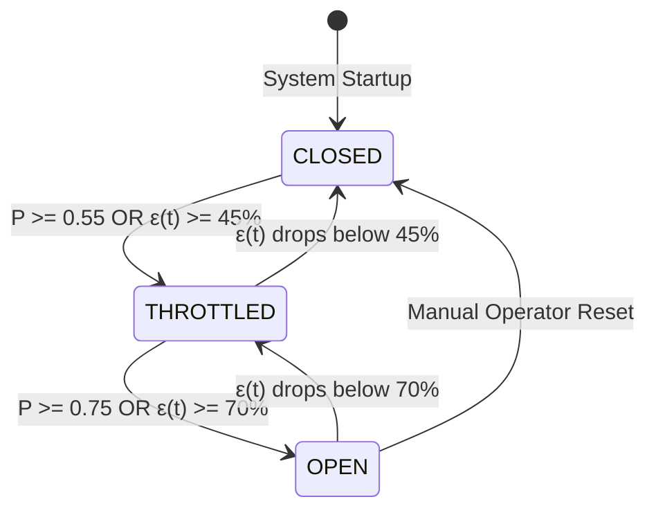

# System Design Document: BACCP

**Boundary-Aware Cross-Generation Cascade Predictor for Airline IT Infrastructure**

---

## 1. System Architecture & Components

The BACCP platform is engineered around six decoupled components:

```text
┌────────────────────────────────────────────────────────────────────────┐
│                        1. Airline Testbed Runtime                      │
│   ┌──────────────┐     ┌──────────────┐     ┌──────────────┐          │
│   │ Reservations │     │     Crew     │     │   Baggage    │ (Cloud)  │
│   └──────┬───────┘     └──────┬───────┘     └──────┬───────┘          │
│          └────────────────────┼────────────────────┘                  │
│                               ▼                                        │
│                 ┌───────────────────────────┐                          │
│                 │     Boundary Gateway      │ (HTTP-to-TCP)            │
│                 └─────────────┬─────────────┘                          │
│                               │                                        │
│                               ▼                                        │
│                 ┌───────────────────────────┐                          │
│                 │    Legacy Mainframe Core  │ (TCP:9090 Isolated)      │
│                 └───────────────────────────┘                          │
└───────────────────────────────┬────────────────────────────────────────┘
                                │ eBPF Kernel Tracing (tcp_v4_connect.bt)
                                ▼
┌────────────────────────────────────────────────────────────────────────┐
│                        2. Data & Graph Pipeline                        │
│   - collect.py (Raw socket log parser)                                 │
│   - aggregate.py (Dependency graph topology builder)                   │
│   - PostgreSQL 16 (Nodes, edges, telemetry storage)                    │
└───────────────────────────────┬────────────────────────────────────────┘
                                │ Canonical Topology & Metrics
                                ▼
┌────────────────────────────────────────────────────────────────────────┐
│                     3. BACCP Backend REST Server                       │
│   - api/app.py (Zero-dependency Python 3 HTTP Server :8000)            │
│   - State synchronization drift computation: ε(t)                      │
│   - Chaos simulation bridge (network-delay, connection-drop, stall)    │
└───────────────────────────────┬────────────────────────────────────────┘
                                │
        ┌───────────────────────┴───────────────────────┐
        ▼                                               ▼
┌───────────────────────────────┐       ┌───────────────────────────────┐
│   4. Cloud Orchestrator       │       │   6. React SRE Dashboard      │
│   (Telemetry -> Prediction -> │       │   - SVG Dependency Graph      │
│    Mitigation -> SNS Alert)   │       │   - Radial Drift Gauge        │
│   backend/cloud/orchestrator  │◄──────┤   - Predictive Alerts Cards   │
└───────────────┬───────────────┘       │   - Service Health Matrix     │
                │                       │   - Circuit Breaker Panel     │
                ▼                       │   frontend/src/* (:3000)      │
┌───────────────────────────────┐       └───────────────────────────────┘
│   5. AWS Cloud Wiring Layer   │
│   - CloudWatch (8 metrics)    │
│   - X-Ray (6 trace paths)     │
│   - SageMaker (Model adapter) │
│   - Lambda (Circuit breaker)  │
│   - SNS (Urgent alerts)       │
└───────────────────────────────┘
```

---

## 2. End-to-End Data Flow

The end-to-end data pipeline follows a structured 7-stage sequence:

1. **Kernel Observation**: As cloud microservices query the gateway, the Linux kernel triggers `kprobe:tcp_v4_connect`. The probe captures the source PID, destination IP, port (8080 or 9090), and socket connection latency without modifying application bytecode.
2. **Graph Assembly**: `aggregate.py` consumes raw observations, resolves container identities via Docker inspect, and synthesizes the generation-typed dependency graph with observed edge frequencies and average latencies.
3. **Drift Computation**: `backend/api/app.py` continuously calculates the digital-twin synchronization drift score $\epsilon(t)$ by comparing incoming transaction velocity against completion rates.
4. **Telemetry Ingestion & Tracing**: In `backend/cloud/orchestrator.py`, the telemetry is published to CloudWatch metric buffers and cross-boundary trace spans are emitted to AWS X-Ray.
5. **Multi-Task Prediction**: The graph, boundary features, and drift scores are fed to the SageMaker predictor (`backend/cloud/sagemaker.py`), computing cascade probability $P_{\text{cascade}}$, lead time $\hat{\tau}$, root cause node, and conformal intervals.
6. **Mitigation Triggering**: If $P_{\text{cascade}} \ge 0.55$, the orchestrator dispatches an automated mitigation invocation to the Lambda integration client (`backend/cloud/lambda_handler.py`), which dynamically adjusts the gateway throttle rate ($30\% - 100\%$).
7. **Incident Dispatch & Display**: The orchestrator triggers Amazon SNS (`backend/cloud/sns.py`), broadcasting an operational alert. The React dashboard polls `/api/alerts` every 6 seconds, rendering critical countdown badges.

---

## 3. REST API Specifications

The backend server ([`backend/api/app.py`](file:///Users/bhiwanshusharma/Documents/Cloud_Project/backend/api/app.py)) provides CORS-compliant REST endpoints:

| Method | Endpoint | Purpose | Request Payload | Response Schema |
| :--- | :--- | :--- | :--- | :--- |
| `GET` | `/api/health` | Overall system health status | None | `{"sync_drift_score": float, "threshold": float, "status": "HEALTHY"\|"DEGRADED"\|"CRITICAL", "formula": str}` |
| `GET` | `/api/health/boundary` | Dedicated boundary health | None | `{"sync_drift_score": float, "threshold": 45.0, "status": str, "description": str}` |
| `GET` | `/api/graph` | Generation-typed topology | None | `{"nodes": [{id, node_type, domain, port}], "edges": [{source, destination, protocol, avg_latency_ms}]}` |
| `GET` | `/api/alerts` | Active predictive alerts | None | `{"cascade_probability": float, "estimated_lead_time_seconds": float, "predicted_root_cause_node": str, "severity": str, "conformal_bounds": {lower, upper}}` |
| `POST` | `/api/predict` | Custom model prediction | `{"graph": obj, "sync_drift_score": float, "telemetry_features": obj}` | Standard cascade prediction schema with 90% conformal bounds |
| `GET` | `/api/telemetry` | Telemetry & recent events | None | `{"metrics": [...], "recent_cloudwatch_metrics": [...], "recent_xray_traces": [...]}` |
| `GET` | `/api/circuit-breaker` | Current breaker state | None | `{"state": "CLOSED"\|"THROTTLED"\|"OPEN", "throttle_rate": float, "target_node": str, "recent_actions": [...]}` |
| `POST` | `/api/circuit-breaker` | Manual mitigation override | `{"action": "THROTTLE", "throttle_rate": 0.5, "reason": str}` | `{"status": "applied", "action": obj, "current_state": obj}` |
| `POST` | `/api/circuit-breaker/action` | Structured Lambda invocation | `{"action": str, "throttle_rate": float, "affected_service": str}` | `{"status": "applied", "action_result": obj, "current_state": obj}` |
| `POST` | `/api/pipeline/run` | Triggers orchestrator cycle | `{"telemetry": obj, "sync_drift_score": float}` | `{"status": "success", "duration_ms": float, "telemetry": obj, "prediction": obj, "mitigation": obj}` |
| `POST` | `/api/simulate/chaos` | Testbed chaos injection | `{"fault": "network-delay"\|"connection-drop"\|"batch-job-stall"\|"clear", "level": "low"\|"medium"\|"high"}` | `{"message": str, "state": obj, "updated_health": obj}` |
| `GET` | `/api/cloud/status` | Operational status of AWS | None | `{"mode": "local"\|"aws", "cloudwatch": obj, "xray": obj, "sagemaker": obj, "lambda": obj, "sns": obj}` |

---

## 4. Graph Representation

The system models the airline topology as a heterogeneous directed graph:

```json
{
  "nodes": [
    {"id": "reservations", "node_type": "cloud-native", "domain": "reservations", "port": 8081, "status": "nominal"},
    {"id": "crew", "node_type": "cloud-native", "domain": "crew-scheduling", "port": 8082, "status": "nominal"},
    {"id": "baggage", "node_type": "cloud-native", "domain": "baggage-handling", "port": 8083, "status": "nominal"},
    {"id": "boundary-gateway", "node_type": "boundary-gateway", "domain": "integration", "port": 8084, "status": "monitoring"},
    {"id": "legacy-core", "node_type": "legacy", "domain": "mainframe-cics", "port": 9090, "status": "uninstrumented"}
  ],
  "edges": [
    {"source": "reservations", "destination": "boundary-gateway", "generation_transition": "cloud-to-gateway", "avg_latency_ms": 18.5},
    {"source": "crew", "destination": "boundary-gateway", "generation_transition": "cloud-to-gateway", "avg_latency_ms": 22.1},
    {"source": "baggage", "destination": "boundary-gateway", "generation_transition": "cloud-to-gateway", "avg_latency_ms": 15.4},
    {"source": "boundary-gateway", "destination": "legacy-core", "generation_transition": "gateway-to-legacy", "avg_latency_ms": 68.2}
  ]
}
```

### Generation Typing
- `cloud-native`: Modern stateless container workloads. High elasticity, low single-call latency variance.
- `boundary-gateway`: Dual-homed protocol converter (HTTP REST to TCP sockets). Primary rate-limiting mitigation target.
- `legacy`: Uninstrumentable, stateful mainframe core. High vulnerability to thread exhaustion.

---

## 5. Telemetry & Metric Formulation

### 1. Digital-Twin State Synchronization Drift $\epsilon(t)$
Measures transactional throughput divergence across the boundary gateway:
$$\epsilon(t) = \frac{\|\Phi(t) - \Psi(t)\|_2}{\|\Phi(t)\|_2 + \delta} \times 100$$
- $\Phi(t)$: Cloud microservice transaction submission rate (tx/sec).
- $\Psi(t)$: Mainframe transaction completion and acknowledgment rate (tx/sec).
- $\delta = 10^{-6}$: Numerical stability regulator.
- Thresholds: Nominal ($\epsilon < 45\%$), Degraded ($45\% \le \epsilon < 70\%$), Critical ($\epsilon \ge 70\%$).

### 2. CloudWatch Metric Schema
Namespace: `BACCP/AirlineCloudHealth`
- `boundary_health_score` (Unit: `Percent`)
- `cascade_probability` (Unit: `None`)
- `prediction_lead_time` (Unit: `Seconds`)
- `service_latency` (Unit: `Milliseconds`, Dimensions: `Service`)
- `error_rate` (Unit: `Percent`, Dimensions: `Service`)
- `request_rate` (Unit: `Count/Second`, Dimensions: `Service`)
- `circuit_breaker_actions` (Unit: `Count`, Dimensions: `Action`, `GatewayNode`)
- `active_alerts` (Unit: `Count`)

---

## 6. Prediction Pipeline & Conformal Uncertainty

The prediction engine outputs a 4-task tuple from shared graph representations:
1. **Cascade Probability $P_{\text{cascade}}$**: Sigmoid classification score indicating probability of cascading failure crossing into cloud services.
2. **Estimated Lead Time $\hat{\tau}$**: Temporal regression modeled after Neural Hawkes intensity:
   $$\hat{\tau} = f_{\text{Hawkes}}(P_{\text{cascade}}, \epsilon(t))$$
   Under critical drift ($P > 0.80$), $\hat{\tau} \in [8, 45]$ seconds; under moderate drift, $\hat{\tau} \in [60, 180]$ seconds.
3. **Failure Location**: Classification head identifying the predicted root cause node (`boundary-gateway`).
4. **Split Conformal Prediction Bounds**:
   Provides distribution-free statistical coverage guarantee:
   $$\mathbb{P}(P_{\text{true}} \in [\hat{P} - \Delta, \hat{P} + \Delta]) \ge 1 - \alpha \quad (1-\alpha=0.90)$$
   Where $\Delta$ is the conformal non-conformity quantile ($~0.08$).

---

## 7. Predictive Alerts & Incident Schema

Alerts are published to Amazon SNS topic and rendered on the frontend dashboard:

```json
{
  "severity": "CRITICAL",
  "cascade_probability": 0.88,
  "affected_service": "reservations",
  "boundary/gateway": "boundary-gateway",
  "gateway": "boundary-gateway",
  "predicted_failure_location": "boundary-gateway",
  "lead_time": 35.0,
  "timestamp": "2026-09-21T16:07:31.165Z",
  "mitigation_status": "OPEN",
  "conformal_bounds": {
    "confidence_level": 0.90,
    "lower": 0.79,
    "upper": 0.97
  }
}
```

---

## 8. Circuit Breaker Mechanism & Mitigation Policy

The circuit breaker operates as a finite state machine scoped specifically to `boundary-gateway`:



- **CLOSED State**: Throttle rate = 0%. All cloud requests pass through to the legacy mainframe unimpeded.
- **THROTTLED State**: Dynamic rate limiting ($30\% - 75\%$). Gateway sheds low-priority queries (seat map browsing, mileage balances) while passing critical checkout transactions.
- **OPEN State**: Throttle rate = 100%. Gateway immediately returns `429 Too Many Requests` or cached fallback responses, isolating the mainframe from catastrophic thread exhaustion.
- **Safety Guardrail**: Local mode simulates executions with in-memory logging, preventing inadvertent disruption of production airline traffic.

---

## 9. AWS Integration & Dual-Mode Provider Architecture

Configured via `backend/cloud/config.py`:
- `CLOUD_MODE=local` (Default):
  - In-memory buffers for CloudWatch metrics and X-Ray trace segments.
  - Analytical inference engine executing calibrated multi-task formulas.
  - Simulated Lambda execution and local alert logging.
- `CLOUD_MODE=aws`:
  - `boto3.client('cloudwatch')` publishes real-time batches to AWS CloudWatch.
  - `boto3.client('sagemaker-runtime')` invokes the hosted RGCN model endpoint.
  - `boto3.client('lambda')` invokes the mitigation function.
  - `boto3.client('sns')` publishes notifications to topic ARN.
